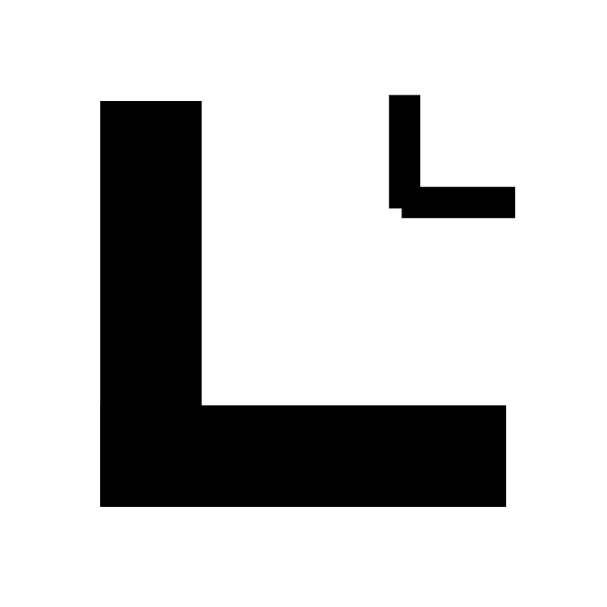

# Little Later &middot; [](https://github.com/facebook/react/blob/main/LICENSE)

Little Later is a personal productivity system designed to keep your online activities organized, effortless, and all in one place — right inside your browser.

This is a local-first application, meaning all your data is stored locally on your device. No cloud storage or third-party servers are involved, ensuring your privacy and control over your information. Most features will likely use local APIs first, though some services may require internet access if they depend on external APIs.

## Requirements

### For Using the Extension

- **Chrome/Chromium-based browser**: Latest stable Chrome (version 140 or higher recommended)

### For Using Little Local

- **Windows**: Windows 10 or higher
- **macOS**: macOS 13+ (Ventura and onwards);
- **Linux**: Ubuntu 18.04 or higher (or equivalent)

### For Building from Source

- **Node.js**: Version 20 or higher
- **pnpm**: Version 10.18.3 or higher
- **TypeScript**: Version 5.6.2 or higher

## Chrome Extension (named, Little Later)

A Chrome extension that reimagines bookmarks, tasks, reminders, and notes into a seamlessly integrated system.

### Visuals

<p align="center">
    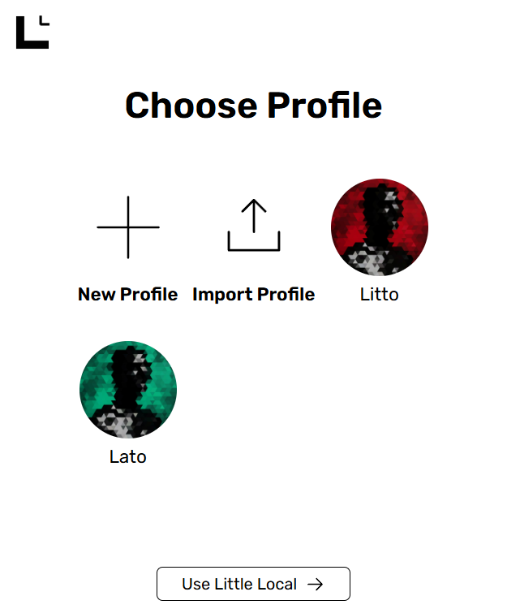
    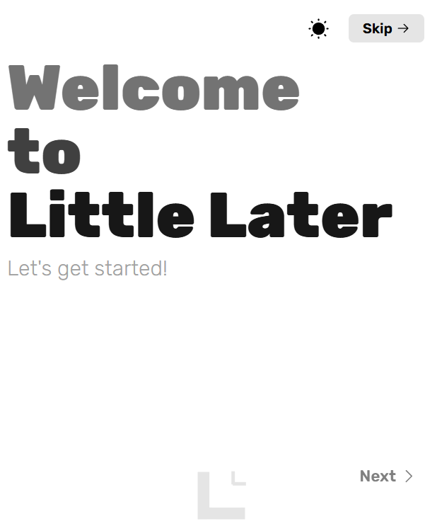
    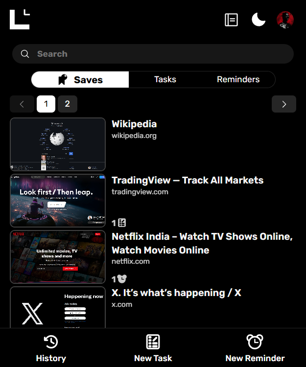
    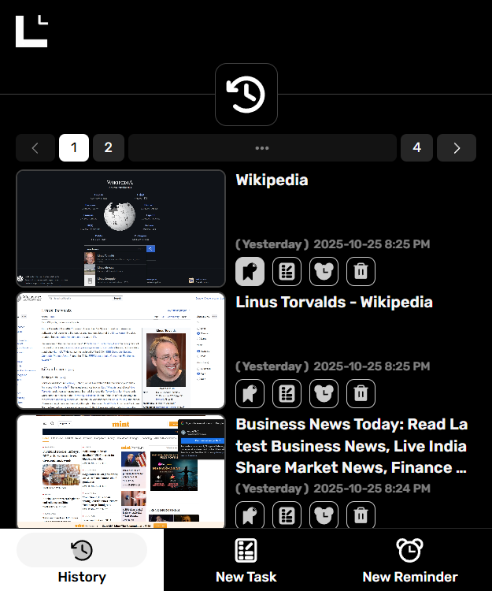
    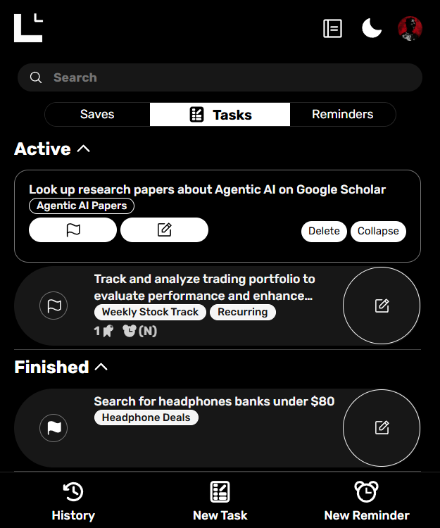
    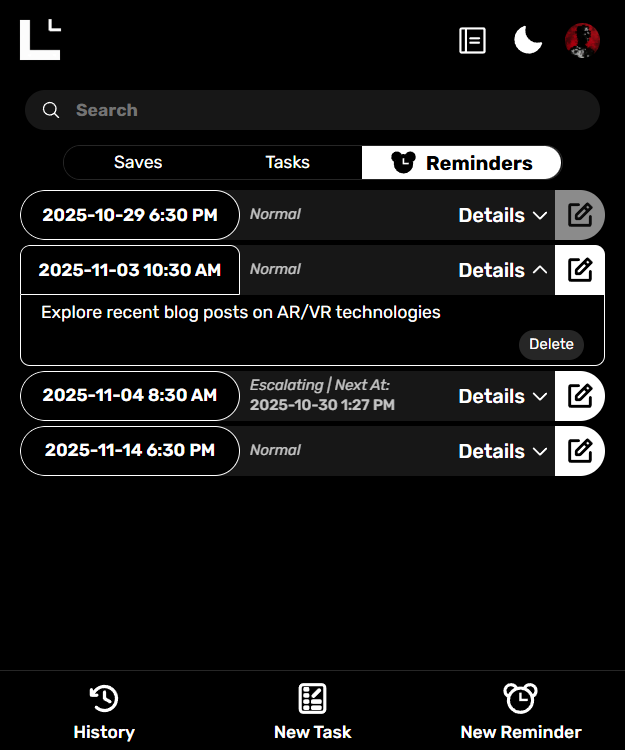
    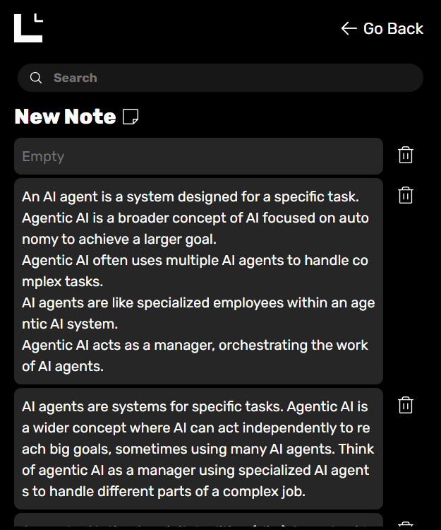
    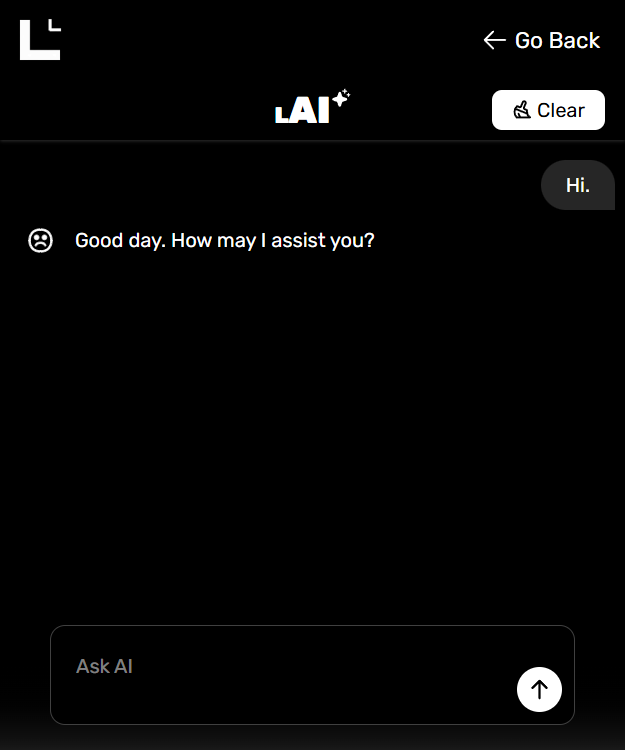
    
    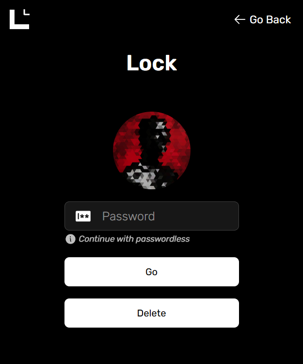
    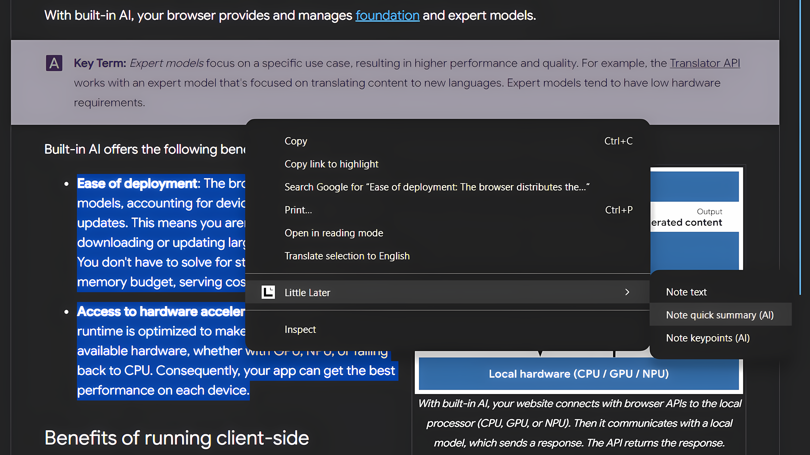
</p>

### Features

- Visual Bookmarks
    - Each visual bookmark has a customizable name
    - Save websites with a live “last seen” preview snapshot.
    - When saved, visual bookmarks are called Saves
    - Access in-app browsing history to bookmark what you’ve recently visited.
    - Have a custom name for each visual bookmark.
    - Organize your saved links visually and contextually.
- Tasks
    - Each task has a description and a label
    - Create Adhoc tasks for spontaneous to-dos.
    - Set recurring schedules — daily, weekly, monthly, or yearly.
    - Set priority levels to manage your workload effectively.
    - Add deadlines to keep track of important dates
- Reminders
    - Each reminder has a message
    - Set one-time or recurring reminders.
    - Notify via browser notifications
- Notes
    - Content can be formatted with rich-text options (bold, italics, underline, strikethrough, headings, lists, links, blockquotes, code blocks, etc.) (only bold and italics for now)
    - Create notes directly from within websites using context menu options.
- Additional
    - Integrations between visual bookmarks, tasks, reminders, and notes
        - Link a note to a visual bookmark
        - Link a visual bookmark to a reminder for added context.
        - Link a reminder to a task to ensure timely completion.
        - Link a visual bookmark to a task for better follow-through.
    - AI
        - AI Assist
            - Helps in searching the feature data semantically
            - Can answer questions based on the content of feature data
            - Can create/update/delete feature data based on user instructions
            - Can answer general questions related to Little Later features and usage
            - and more...
        - AI Rephrase
            - Rephrases task description
        - AI Generate
            - Generates label for task description
        - AI Summarize
            - Takes the note content and can summarize it into two forms - bullet points for important information and a short paragraph for quick overall overview.
    - Profiles
        - Multiple profiles to separate personal and work data
        - Each profile has its own data storage
    - Encryption
        - For user-experience and data security, profiles can be encrypted with a password when its not in use and can be decrypted when user wants to access the data.
    - Data Transfer
        - Export and import profiles out/into the extension
    - Theme
        - Light and Dark mode
    - Search
        - Search across all features from a single search bar
            - Visual bookmarks, tasks, and reminders in the same search results and notes in separate search results
        - Filter search results by feature type

### Installation

1. Go to **[Releases](https://github.com/AndysTMC/Little-Later/releases/latest)**.
1. Download the `Little-Later-{version}.zip` file from the releases section and extract it to a folder
1. Alternatively, clone the repository and build from source
1. Load the extension in Chrome
    - Open Chrome and go to `chrome://extensions/`
    - Enable "Developer mode" using the toggle in the top right corner
    - Click on "Load unpacked" and select the `dist` folder inside `apps/little-later`
    - The extension should now be loaded and visible in your browser toolbar

## Electron Application (named, Little Local)

A companion app that provides some additional features to the Chrome extension

### Features

- Cross Profile Sharing
    - Extension data syncs across all Chrome profiles, so you can use the extension everywhere with the same data
- Local Storage
    - All data is stored locally on your device
- Secure AI Requests
    - API requests are routed through Little Local, keeping your API keys safe and secure
- Native Notifications
    - Reminders use electron notifications that works even when Chrome is closed.

### Installation

1. Go to **[Releases](https://github.com/AndysTMC/Little-Later/releases/latest)**.
1. Download the appropriate installer for your platform:
    - **Windows**: `Little-Local-Setup-{version}.exe`
    - **macOS**: `Little-Local-{version}.dmg`
    - **Linux**: `Little-Local-{version}.AppImage`
1. Run the installer and follow the installation prompts
1. Alternatively, clone the repository and build from source

## Verify Download Integrity

Each release includes SHA256 checksums to verify the authenticity and integrity of downloaded files.

### How to Verify

1. Download both the release file and its corresponding `.sha256` file from the [Releases](https://github.com/AndysTMC/Little-Later/releases/latest) page
2. Verify the checksum using your platform's command:

**Windows (PowerShell)**

```powershell
# Compare the hash (replace {version} with actual version number, e.g., 1.0.0)
(Get-FileHash -Algorithm SHA256 "Little-Later-{version}.zip").Hash -eq (Get-Content "Little-Later-{version}.zip.sha256" -Raw).Split()[0]
```

**macOS/Linux**

```bash
# Verify the checksum (replace {version} with actual version number, e.g., 1.0.0)
sha256sum -c Little-Later-{version}.zip.sha256
```

3. If verification succeeds, the download is authentic and hasn't been tampered with

> **Note:** Always verify checksums before installation, especially for executable files.

## Build from Source

1. Clone the repository
    ```bash
    git clone https://github.com/AndysTMC/Little-Later.git
    ```
2. Build the application
    - Install pnpm if you don't have it already
    ```bash
    npm install -g pnpm
    ```
    ```bash
    pnpm install
    pnpm run build
    ```
3. Run the application

## Contributing

We love bug fixes and welcome feature suggestions via Issues.
Large feature PRs will be closed with a polite note – we keep the scope tight.

How to contribute

1. Fork the repo.
2. Create a branch: git checkout -b fix/xyz or bug/xyz.
3. Follow the code style (Prettier config is in the repo).
4. Write a clear commit message.
5. Open a Pull Request referencing the issue.

See the full policy in [CONTRIBUTING.md](/CONTRIBUTING.md).

### Code of Conduct

We expect everyone to follow the [Code of Conduct](/CODE_OF_CONDUCT.md).

### License

This project is licensed under the MIT License - see the [LICENSE](/LICENSE.md) file for details.

## Acknowledgements

[React](https://reactjs.org/)
| [Vite](https://vitejs.dev/) [Dexie.js](https://dexie.org/)
| [TypeScript](https://www.typescriptlang.org/)
| [Framer Motion](https://www.framer.com/motion/)
| [Tailwind CSS](https://tailwindcss.com/)
| [Socket.IO](https://socket.io/)
| [OpenAI](https://openai.com/)
| [Chrome Built-in APIs](https://developer.chrome.com/docs/ai/built-in-apis)
| [Electron](https://www.electronjs.org/)
| [Node.js](https://nodejs.org/)
| [Express](https://expressjs.com/)
| [Better-SQLite3](https://github.com/WiseLibs/better-sqlite3)
| [pnpm](https://pnpm.io/)
| [Prettier](https://prettier.io/)
