# Little Later &middot; [](https://github.com/facebook/react/blob/main/LICENSE)

Little Later is a local-first Chrome extension for organizing visual bookmarks, tasks, reminders, and notes.

All data stays local to your browser profile (with optional encrypted profile vaults).

## Requirements

### For Using the Extension

- **Chrome/Chromium-based browser**: Latest stable Chrome (version 140 or higher recommended)

### For Building from Source

- **Node.js**: Version 20 or higher
- **Bun**: Version 1.3.11 or higher
- **TypeScript**: Version 5.6.2 or higher

## Chrome Extension (Little Later)

A Chrome extension that reimagines bookmarks, tasks, reminders, and notes into a seamlessly integrated system.

### Visuals

<p align="center">
    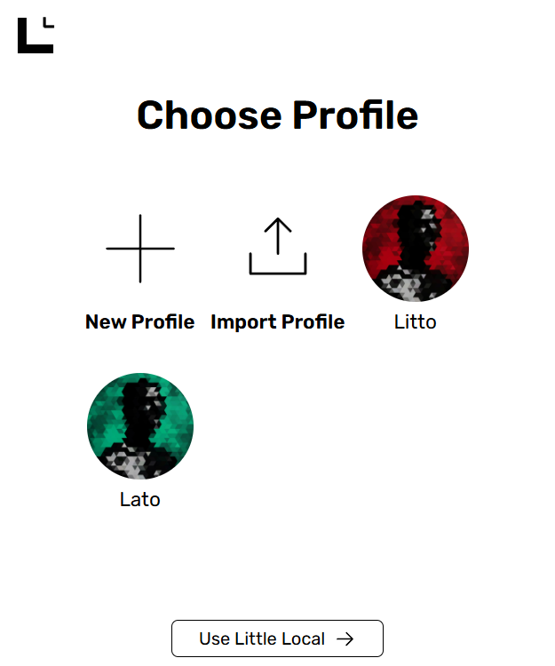
    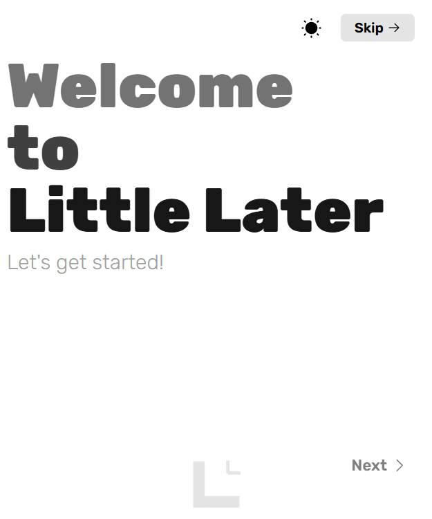
    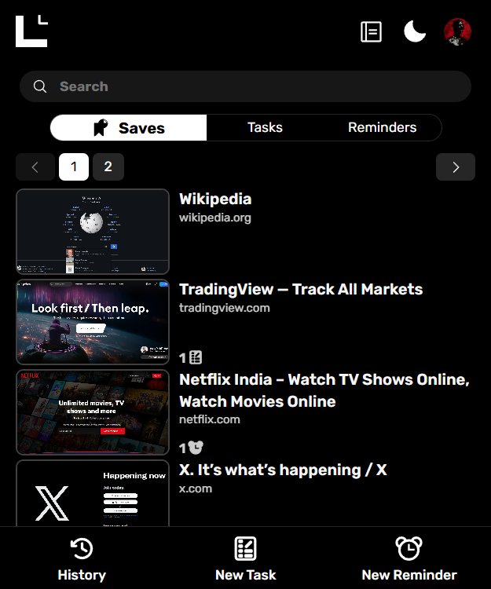
    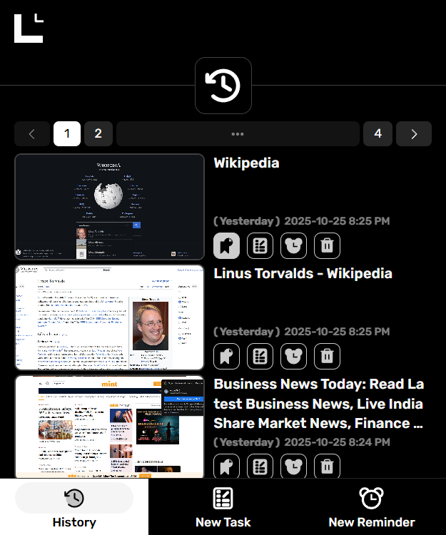
    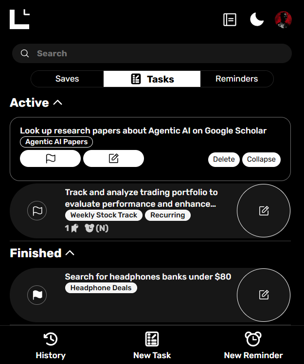
    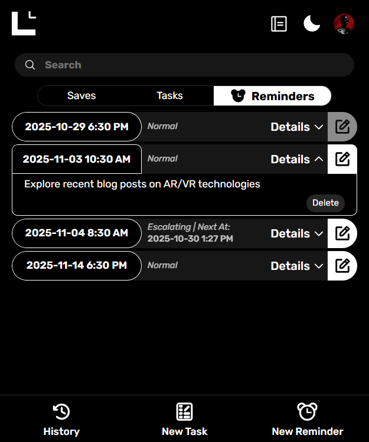
    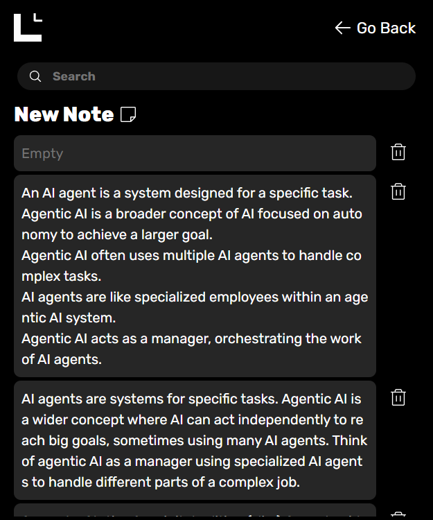
    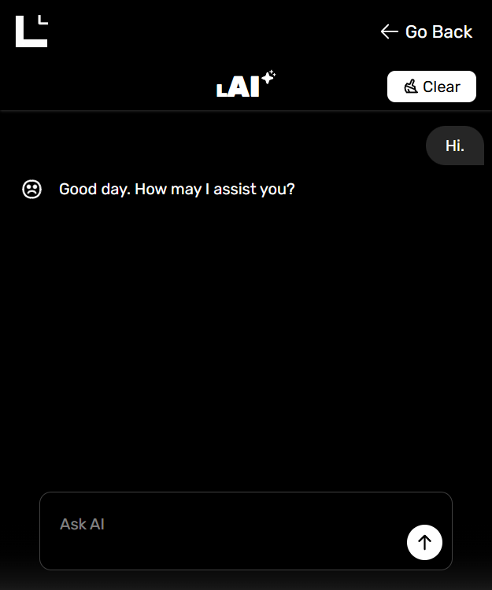
    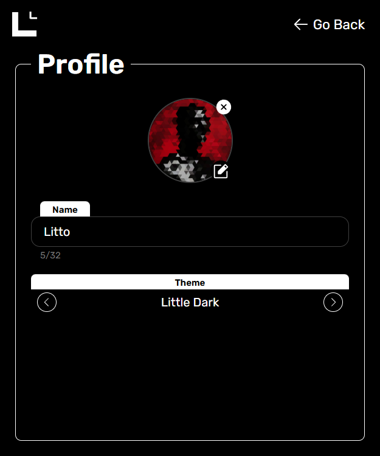
    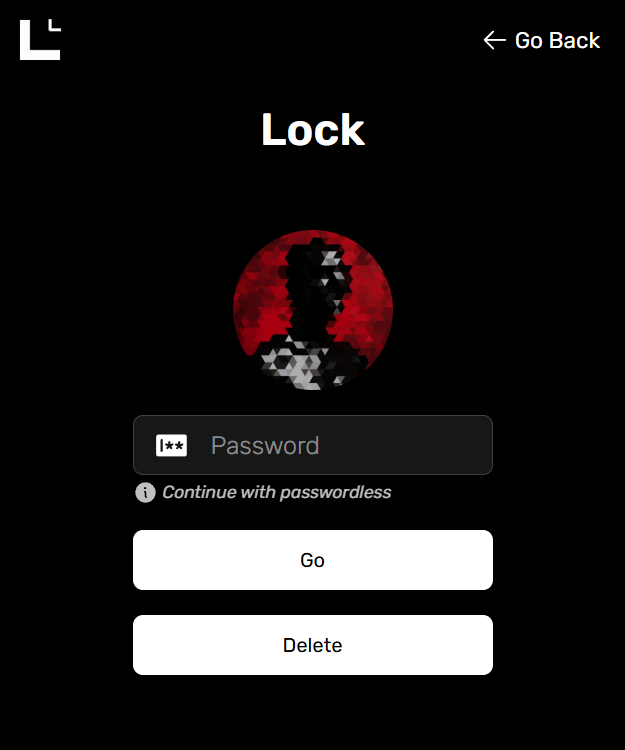
    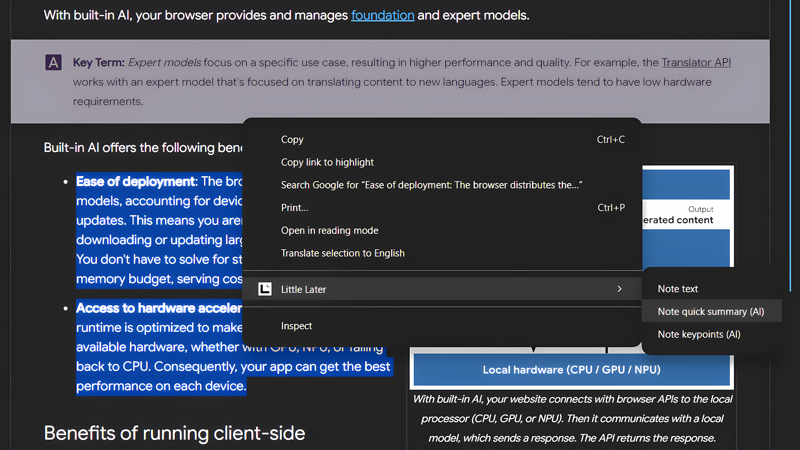
</p>

### Features

- Visual Bookmarks (Saves + History previews)
- Tasks (adhoc, due, recurring)
- Reminders (including recurring)
- Notes (rich text essentials)
- Cross-feature linking (Save/Task/Reminder/Note)
- AI Assist/Rephrase/Generate/Summarize
- Multi-profile support with lock/unlock
- Data export/import
- Light and dark themes
- Unified search

### Installation

1. Go to **[Releases](https://github.com/AndysTMC/Little-Later/releases/latest)**.
2. Download and extract `Little-Later-{version}.zip`.
3. Open `chrome://extensions/`.
4. Enable **Developer mode**.
5. Click **Load unpacked** and select `dist`.

## Verify Download Integrity

Each release includes SHA256 checksums.

### How to Verify

1. Download the extension ZIP and matching `.sha256` file from the [Releases](https://github.com/AndysTMC/Little-Later/releases/latest) page.
2. Verify checksum:

**Windows (PowerShell)**

```powershell
(Get-FileHash -Algorithm SHA256 "Little-Later-{version}.zip").Hash -eq (Get-Content "Little-Later-{version}.zip.sha256" -Raw).Split()[0]
```

**macOS/Linux**

```bash
sha256sum -c Little-Later-{version}.zip.sha256
```

## Build from Source

```bash
git clone https://github.com/AndysTMC/Little-Later.git
cd Little-Later
bun install
bun run build
```

## Contributing

We love bug fixes and welcome feature suggestions via Issues.
Large feature PRs may be closed to keep scope tight.

1. Fork the repo.
2. Create a branch (for example: `fix/xyz`).
3. Follow repo formatting rules.
4. Write a clear commit message.
5. Open a Pull Request linked to an issue.

See [CONTRIBUTING.md](/CONTRIBUTING.md) for full policy.

### Code of Conduct

Please follow [CODE_OF_CONDUCT.md](/CODE_OF_CONDUCT.md).

### License

MIT — see [LICENSE](/LICENSE.md).

## Acknowledgements

[React](https://reactjs.org/)
| [Vite](https://vitejs.dev/)
| [Dexie.js](https://dexie.org/)
| [TypeScript](https://www.typescriptlang.org/)
| [Framer Motion](https://www.framer.com/motion/)
| [Tailwind CSS](https://tailwindcss.com/)
| [OpenAI](https://openai.com/)
| [Chrome Built-in APIs](https://developer.chrome.com/docs/ai/built-in-apis)
| [Node.js](https://nodejs.org/)
| [Bun](https://bun.sh/)
| [Prettier](https://prettier.io/)
